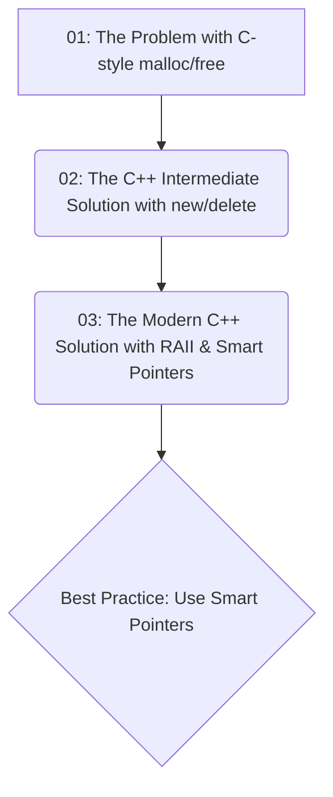

# The Evolution of C++ Memory Management

This repository contains a guided learning module to demonstrate the evolution of memory management in C++, from the C-style `malloc`/`free` to modern C++ smart pointers. The goal is to show *why* modern C++ practices are safer and more robust by illustrating the problems they solve.

The module is structured as a three-step journey. Each step is a self-contained program that builds on the last, clearly showing the progression of ideas and techniques.

## 📚 Documentation

Complete documentation, including a detailed learning roadmap and supporting references, is available in the Google Drive folder.

*   [**Main Documentation Bundle**](https://docs.google.com/document/d/1GrDQS1RSVXe7Rj8j9l8hxkSyFkpmxO3Y6OzEgltVeoI/edit?usp=drivesdk)
*   [**Project Drive Folder**](https://drive.google.com/drive/folders/1QUn4KOnYsk1cG3eQLmsw-sD3Iwuh8xnu)

## The Three-Act Narrative

This repository tells a story in three parts. You should explore the directories in order to understand the narrative.



1.  **`01-c-style-malloc`**: We start by looking at the C-style way of manual memory management. This section highlights the dangers and shortcomings when applying it in C++: lack of type safety, no automatic constructor/destructor calls.
2.  **`02-cpp-new-delete`**: Next, we see C++'s direct answer to `malloc`: `new` and `delete`. This is a big improvement, providing type safety and ensuring constructors/destructors are called. However, it still relies on manual intervention, which is fragile and prone to memory leaks.
3.  **`03-modern-smart-pointers`**: Finally, we arrive at the modern C++ solution: smart pointers (`std::unique_ptr`) and the **Resource Acquisition Is Initialization (RAII)** principle. This approach automates memory management, making code safer, cleaner, and more robust.

## Concepts Covered

*   Manual memory management with `malloc` and `free`.
*   The pitfalls of `void*` and manual type casting.
*   C++ object lifecycle (constructor/destructor).
*   Type-safe memory allocation with `new` and `delete`.
*   The risks of manual resource management (memory leaks).
*   The RAII (Resource Acquisition Is Initialization) principle.
*   Automated memory management with `std::unique_ptr`.
*   Factory functions for safety with `std::make_unique`.

## How to Run

Each numbered directory is a standalone example. To compile and run each step:

```bash
# Navigate to the specific step
cd 01-c-style-malloc

# Compile the source file (using g++)
g++ main.cpp -o main

# Run the executable
./main
```
Repeat for `02-cpp-new-delete` and `03-modern-smart-pointers`. Observe the output and read the comments in each `main.cpp` file to understand what is happening.

## Unambiguous Recommendation

> **Always prefer smart pointers (`std::unique_ptr`, `std::shared_ptr`) over raw `new`/`delete` in modern C++.**

## References
*   [C++ Core Guidelines: Resource Management](https://isocpp.github.io/CppCoreGuidelines/CppCoreGuidelines#S-resource)
*   [std::unique_ptr - cppreference.com](https://en.cppreference.com/w/cpp/memory/unique_ptr)
*   [RAII - cppreference.com](https://en.cppreference.com/w/cpp/language/raii)
