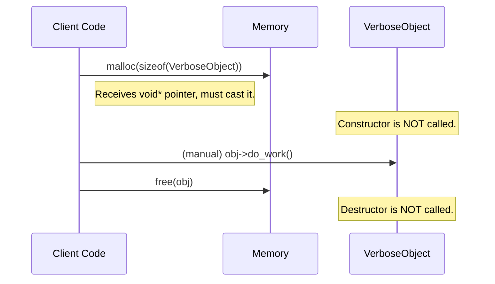
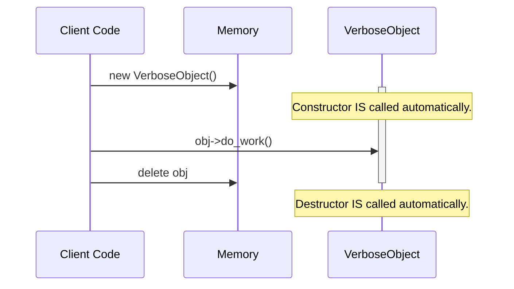
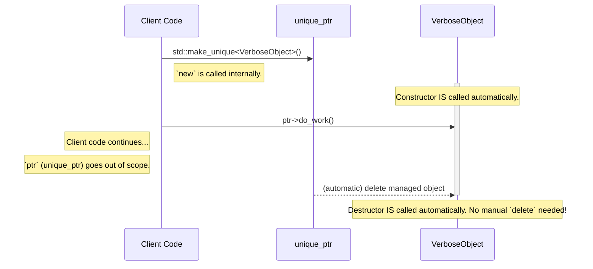

# Architecture and Object Lifecycle

This document provides a deeper look into the architecture of this learning module, focusing on how object lifetimes are managed in each of the three stages.

## The `VerboseObject`

The key to this module is the `common/VerboseObject.h`. This simple class acts as a visual aid. By printing messages in its constructor and destructor, it allows us to see precisely when an object's life begins and ends. The entire learning narrative hinges on whether the constructor and destructor are called as expected.

## Lifecycle Sequence Diagrams

The following diagrams illustrate the sequence of events for object creation and destruction in each of the three scenarios.

### 1. `malloc`/`free` Lifecycle

With `malloc`, the C++ runtime has no knowledge of object-oriented semantics. It allocates raw memory, but it does *not* call the constructor. Likewise, `free` releases the memory but does *not* call the destructor. This is the central problem.

**Result:** The object is never properly constructed or destructed, leading to undefined behavior if the constructor initializes state and resource leaks if the destructor is meant to release resources.

### 2. `new`/`delete` Lifecycle

`new` and `delete` are a significant improvement. The `new` operator is type-aware. It allocates memory *and* calls the constructor. `delete` calls the destructor *and* deallocates the memory. However, the process is still manual.

**Result:** The object has a correct and complete lifecycle. The risk, however, is human error: if the developer forgets `delete` or an exception is thrown before `delete` is reached, the destructor never runs, and a memory leak occurs.

### 3. Smart Pointer (`std::unique_ptr`) Lifecycle

Smart pointers, combined with the RAII principle, automate the `new`/`delete` process. The `std::unique_ptr` is an object that wraps our raw pointer. When the `unique_ptr` itself is created, it takes ownership of the dynamic object. When the `unique_ptr` goes out of scope, its own destructor is called, which in turn calls `delete` on the object it manages.

**Result:** The object's lifecycle is tied to the scope of the `unique_ptr`, making resource management automatic, safe, and robust. It is impossible to forget to call `delete`. This is the foundation of modern C++ resource management.
